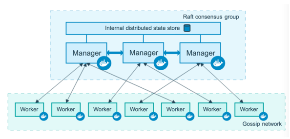

# docker swarm

<figure style="position: absolute; bottom: 50px; right: 300px">
    
</figure>

## Principes

 - Gère des clusters d'hôte docker
   

 - Basé sur l'API de docker (compatible avec compose)

  * ouvrir le daemon docker sur TCP
  * configurer TLS
  * 1 manager
  * x nodes
  

 - La création / répartition des conteneur est à la charge de swarm
  

 - Aléatoire / Répartition de charge / Contraintes

## Clustering

## Pour aller plus loin

Très haute disponibilité / Service discovery

- Consul: https://www.consul.io/
- Zookeeper: https://zookeeper.apache.org/
- Etcd: https://coreos.com/etcd/

 
Reverse proxy pour avoir un seul point d'entrée

https://traefik.io

# Demo time

